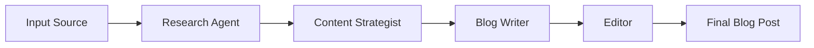

# Blog Writer with CrewAI 🤖✍️


A powerful AI-powered blog writing system built with CrewAI that generates high-quality blog posts from various input sources including URLs, PDFs, and images.

## 🌟 Features

- 🤖 AI-powered content generation using CrewAI
- 📄 Multiple input sources support (URL, PDF, Image)
- 🎯 SEO-optimized content creation
- 💡 Smart content research and structuring
- ✨ Customizable tone and style
- 📊 Word count control
- 🔍 Keyword optimization
- 📝 Professional editing and proofreading

## 🛠️ System Architecture

The system utilizes four specialized AI agents:

1. **Research Agent** 🔍
   - Conducts thorough topic research
   - Analyzes source materials
   - Gathers relevant statistics and data

2. **Content Strategist** 📋
   - Develops content structure
   - Creates SEO strategy
   - Plans content flow

3. **Blog Writer** ✍️
   - Creates engaging content
   - Maintains consistent tone
   - Implements SEO best practices

4. **Editor** ✏️
   - Ensures quality control
   - Maintains style consistency
   - Performs final polishing

## 🚀 Getting Started

### Prerequisites

```bash
# Python 3.8 or higher required
python --version
```

### Installation

1. Clone the repository:
```bash
git clone https://github.com/Swty13/blog-writer-crewai.git
cd blog-writer-crewai
```

2. Install dependencies:
```bash
pip install -r requirements.txt
```

3. Set up LLM:

Add your LLM in llm_call.py file by making function get_llm


### Running the Application

```bash
streamlit run app.py
```

## 📝 Usage

1. **Launch the Application**
   - Open your browser to `http://localhost:8501`

2. **Select Input Source**
   - Choose between URL, PDF, or Image input
   - Upload your source material or enter URL

3. **Configure Blog Settings**
   - Enter topic and target audience
   - Set desired word count
   - Choose tone of voice
   - Add target keywords

4. **Generate Content**
   - Click "Generate Blog Post"
   - Wait for the AI crew to work their magic
   - Download your finished blog post

## 📦 Dependencies

```
crewai==0.1.0
streamlit==1.24.0
PyPDF2==3.0.1
Pillow==9.5.0
python-dotenv==0.21.1
requests==2.31.0
```

## 🛠️ Configuration

Key configuration options in `config.py`:

```python
WORD_COUNT_LIMITS = {
    'MIN': 300,
    'MAX': 3000,
    'DEFAULT': 800
}

TONE_OPTIONS = [
    'Professional',
    'Casual',
    'Technical',
    'Conversational',
    'Educational'
]
```

## 🌟 Example Output

```markdown
# How to Build a Successful Content Strategy

In today's digital landscape, creating engaging content...
[Generated blog post content]
```

## 🔄 Workflow



## 🤝 Contributing

1. Fork the repository
2. Create your feature branch (`git checkout -b feature/amazing-feature`)
3. Commit your changes (`git commit -m 'Add amazing feature'`)
4. Push to the branch (`git push origin feature/amazing-feature`)
5. Open a Pull Request

## 📄 License

This project is licensed under the MIT License - see the [LICENSE](LICENSE) file for details.

## 👏 Acknowledgments

- [CrewAI](https://github.com/joaomdmoura/crewAI) for the amazing AI framework
- [Streamlit](https://streamlit.io/) for the web interface
- [Azure OpenAI](https://azure.microsoft.com/en-us/services/cognitive-services/openai-service/) for the language models

---
Made with ❤️ by [Sweety]
